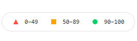

# CDN

Importance of use CDN's in your app

# Tools used for testing

[LightHouse by GoogleChrome](https://github.com/GoogleChrome/lighthouse)

# Test metrics

Performance,
Accessibilty,
Best Practices,
SEO

 

## Desktop :

 

| Type                     | Bad Solution Metrics(average) | Good Solution Metrics(average) |
| ------------------------ | ----------------------------- | ------------------------------ |
| Performance              | 63.3                          | 73.3                           |
| Accessibilty             | 95                            | 95                             |
| Best Practices           | 80                            | 87                             |
| SEO                      | 100                           | 100                            |
| First Contentful Paint   | 0.3 s                         | 0.4 s                          |
| Time To Interactive      | 6.56 s                        | 0.96 s                         |
| Speed Index              | 1.03 s                        | 0.7 s                          |
| Total Blocking Time      | 80 ms                         | 73.3 ms                        |
| Largest Contentful Paint | 12.83 s                       | 10.5 s                         |
| Cumulative Layout Shift  | 0.094                         | 0.088                          |

 

## Mobile :

 

| Type                     | Bad Solution Metrics(average) | Good Solution Metrics(average) |
| ------------------------ | ----------------------------- | ------------------------------ |
| Performance              | 58                            | 71                             |
| Accessibilty             | 95                            | 95                             |
| Best Practices           | 80                            | 80                             |
| SEO                      | 100                           | 100                            |
| First Contentful Paint   | 1.2 s                         | 1.4 s                          |
| Time To Interactive      | 27.066 s                      | 4.1 s                          |
| Speed Index              | 4.56 s                        | 2.5 s                          |
| Total Blocking Time      | 210 ms                        | 163.3 ms                       |
| Largest Contentful Paint | 50.03 s                       | 50.5 s                         |
| Cumulative Layout Shift  | 0.052                         | 0.03                           |
